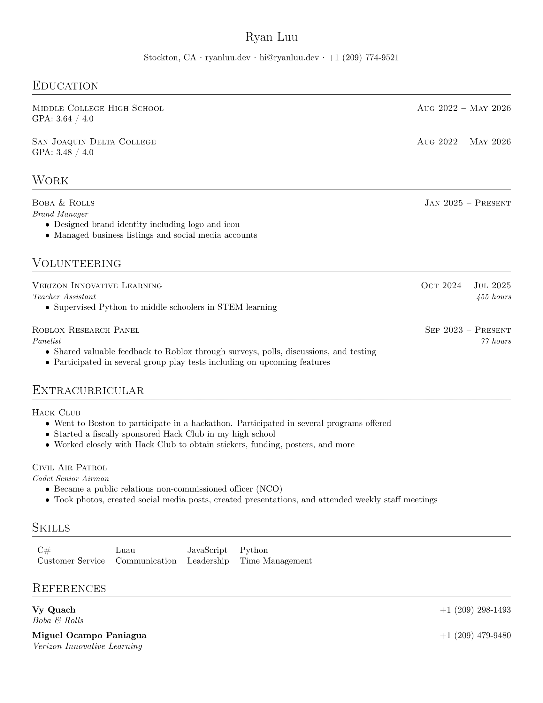

# Personal Resume

My academic resume, which I wrote in LaTeX entirely from scratch on [Overleaf](https://www.overleaf.com/). Designed to be minimal and easy to maintain.

Inspired by [Rover Resume](https://github.com/subidit/rover-resume) and "[How to write a LaTeX class file and design your own CV](https://www.overleaf.com/learn/latex/How_to_write_a_LaTeX_class_file_and_design_your_own_CV_(Part_1))".



## LaTeX Engine

This resume is compiled using [LuaLaTeX](https://www.luatex.org/). Make sure to [select LuaLaTeX instead of the default pdfLaTeX as the compiler in Overleaf](https://docs.overleaf.com/getting-started/recompiling-your-project/selecting-a-tex-live-version-and-latex-compiler#changing-the-compiler).

If you want to use pdfLaTeX, you need to add the following lines to [`my_cv.cls`](my_cv.cls):

```tex
% ATS compatibility
\RequirePackage[T1]{fontenc}
\input{glyphtounicode}
\pdfgentounicode=1
```

LuaLaTeX is recommended because it has better support for modern fonts and Unicode characters.